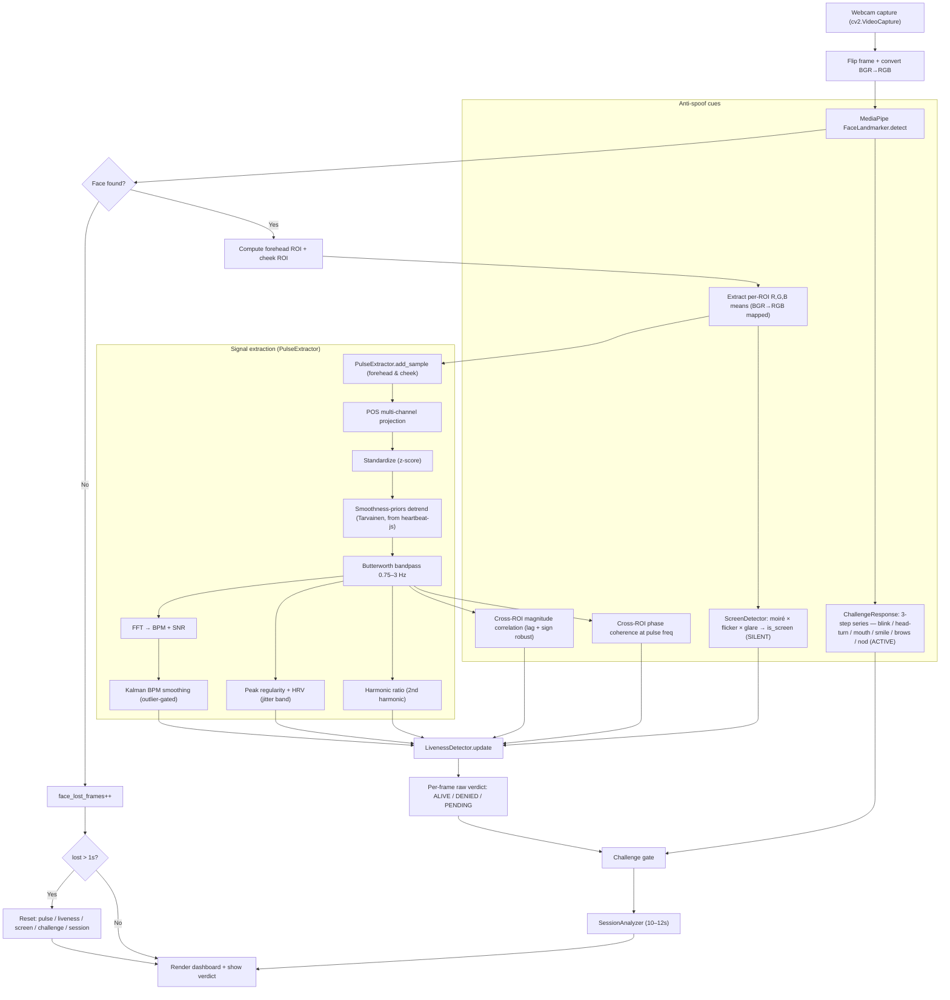
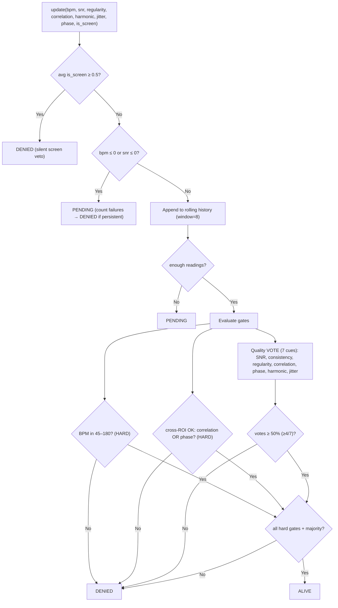
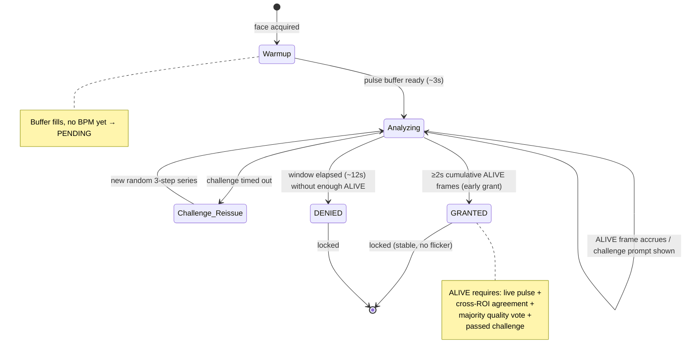
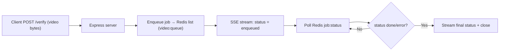

# Bio-Pulse Authenticator — Project Workflow

## 1. End-to-end pipeline (per frame)

## 2. LivenessDetector decision logic (per frame)

## 3. Session + challenge → final locked verdict

## 4. Optional backend service (BE — Node/Express + Redis)

## Key idea
Appearance-based detectors ask *"does this look real?"*. Bio-Pulse asks *"is this body alive?"* — proving a real, frequency-correct heartbeat (rPPG) that is spatially consistent across face regions, while an attacker must simultaneously beat the pulse checks, cross-ROI blood-flow consistency, an active liveness challenge, and a silent screen-replay detector — all on a commodity webcam.
